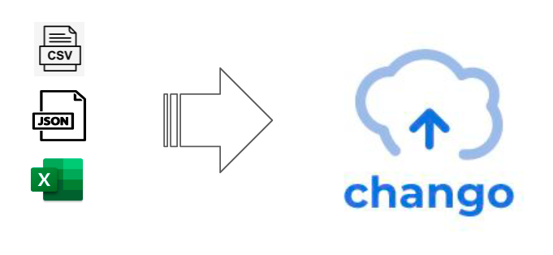

# Chango Data Ingestion

Chango Private provides components like `Chango Data API` and `Chango Streaming` to insert external data to Chango with ease.

## Upload Files

As data analytics engineer, you don’t have to struggle with long row Excel to analyze data. SQL is better to analyze data. 
External data like CSV, Excel, JSON can be inserted directly to iceberg table in chango, 
then you can explore and analyze iceberg tables with trino queries.

## Streaming

External event streaming application can insert streaming events into iceberg tables in chango without building streaming platform and writing streaming jobs.

### No Streaming Platform, No Streaming Jobs

If you want to insert streaming events like user behavior events, logs, IoT events to data lakehouses, you need to build event streaming platform like kafka
and write streaming jobs like spark streaming jobs in most cases. But in chango, you don't have to do so.

External streaming application can insert streaming events to iceberg tables in chango directly without streaming platform and streaming jobs.

## Analyze Logs

[Chango Log](https://github.com/cloudcheflabs/chango-log) is a log agent to read local log files and send logs
to Chango to analyze logs. 
Using `Chango Log`, you can analyze logs from all your distributed logs joining different databases in richer manner realtimely in Chango.
See <a href="../../user-guide/chango-log/">Reading Log Files Using Chango Log</a> for more details.
## Change Data Capture

[Chango CDC](https://github.com/cloudcheflabs/chango-cdc) is Change Data Capture application to catch CDC data of database
and send CDC data to Chango.
You don't need such as Kafka and Kafka Connect cluster to accomplish CDC. Just using `Chango CDC`, you can achieve your goals to see and analyze 
your distributed data in realtime in Chango. See <a href="../../user-guide/chango-cdc/">Change Data Capture Using Chango CDC</a> for more details.

