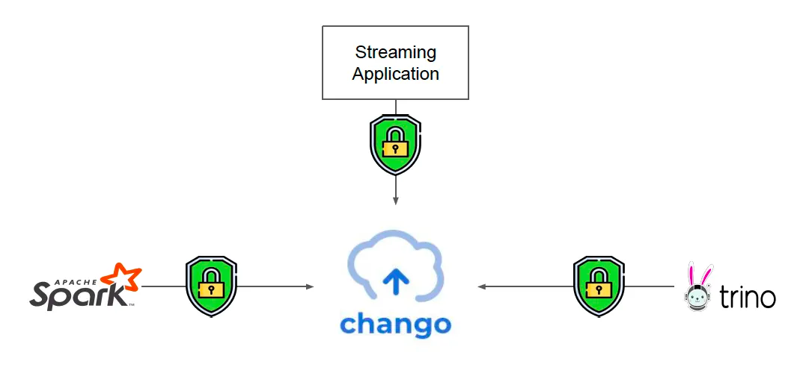

# Chango Private Storage Security

Fine-grained data access control using RBAC to chango storage.

## Overview

There are several ways to access data in chango storage. For example,

- External streaming applications want to produce streaming events to chango.
- Spark jobs want to read / write data in iceberg tables in chango.
- Trino wants to read / write data in iceberg tables in chango.

Such data accesses to chango need to be controlled by Chango Storage RBAC.
With Chango Storage RBAC, all data accesses will be controlled in the fine-grained manner like catalog level, schema level and table level. 

## Credential, Role and Privileges

A role can have many credentials and many privileges. There are `READ` and `WRITE` type in privilege. 
Each privilege has storage access path with the convention of `<catalog>`.`<schema>`.`<table>`.

- `iceberg.events.behavior` with `WRITE` : user / credential has the `WRITE` privilege to table behavior in `events` schema of `iceberg` catalog.
- `iceberg.events.*` with `READ`: user / credential has the `READ` privilege to all the tables in `events` schema of `iceberg` catalog.
- `mysql.*` with `READ`: user / credential has the `READ` privilege to all the tables in all schemas of `mysql` catalog.
- `*` with `WRITE`: user / credential has the `WRITE` privilege to all the tables in all schemas of all catalogs.

