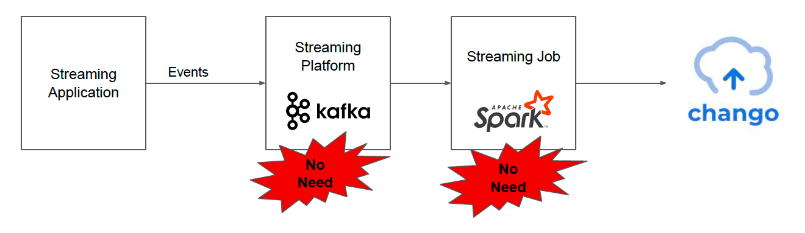
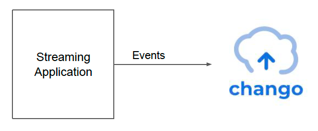

# Chango Streaming

External event streaming application can insert streaming events into iceberg tables in chango without building streaming platform and writing streaming jobs.

## No Streaming Platform, No Streaming Jobs

If you want to insert streaming events like user behavior events, logs, IoT events to data lakehouses, you need to build event streaming platform like kafka
and write streaming jobs like spark streaming jobs in most cases. But in chango, you don't have to do so. 

External streaming application can insert streaming events to iceberg tables in chango directly without streaming platform and streaming jobs.

