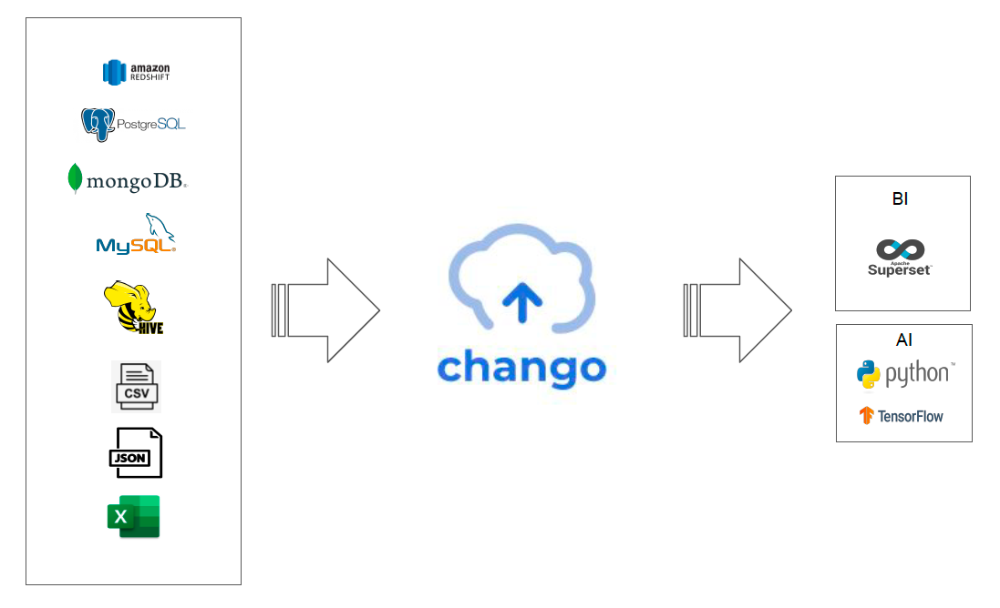

# What is Chango?

Chango is unified data lakehouse platform to solve the problems which occur in your data area, 
which can be installed either in online/public or in offline/disconnected environment.

Chango provides popular open source engines like spark, trino, kafka and iceberg as lakehouse table format 
and several chango specific components.

## Chango Data Lakehouse Platform

In `Ingestion` layer:

- `Spark` and `Trino` with `dbt` or `Chango Query Exec` will be used as data integration tool.
- `Kafka` is used as event streaming platform to handle streaming events.
- `Chango Ingestion` will be used to insert incoming streaming events to Chango directly.

In `Storage` layer:

- Chango supports Apache Ozone as object storage by default and external S3 compatible object storage like AWS S3, MinIO, OCI Object Storage.
- Data lakehouse format is `Iceberg` table format in Chango.

In `Transformation` layer:

- `Spark` and `Trino` with `Chango Query Exec` will be used to run ETL jobs.

In `Analytics` layer:

- `Trino` is used as query engine to explore all the data in Chango.
- `BI` tools like `Apache Superset` will connect to `Trino` to run queries through `Chango Trino Gateway`.

In `Management` layer:

- `Azkaban` is used as workflow. All the batch jobs like ETL can be integrated with `Azkaban`.
- `Chango REST Catalog` is Iceberg REST Catalog and used as data catalog in Chango.
- Chango supports storage security to control data access based on RBAC in Chango. `Chango Authorizer` will be used for it.
- `Chango Trino Gateway` is an implementation of Trino Gateway concept. `Chango Trino Gateway` provides several features like authentication, authorization, smart query routing(routing to less exhausted trino clusters), trino cluster activation/deactivation. For more details, see <a href="../../features/trino-gw/">Chango Trino Gateway</a>.
- `Chango Spark SQL Runner` exposes REST API to which clients send spark sql queries using REST to execute spark queries.
- `Chango Thrift Server` exposes JDBC/Thrift to which clients send spark sql queries using JDBC/Thrift to execute spark queries.

 