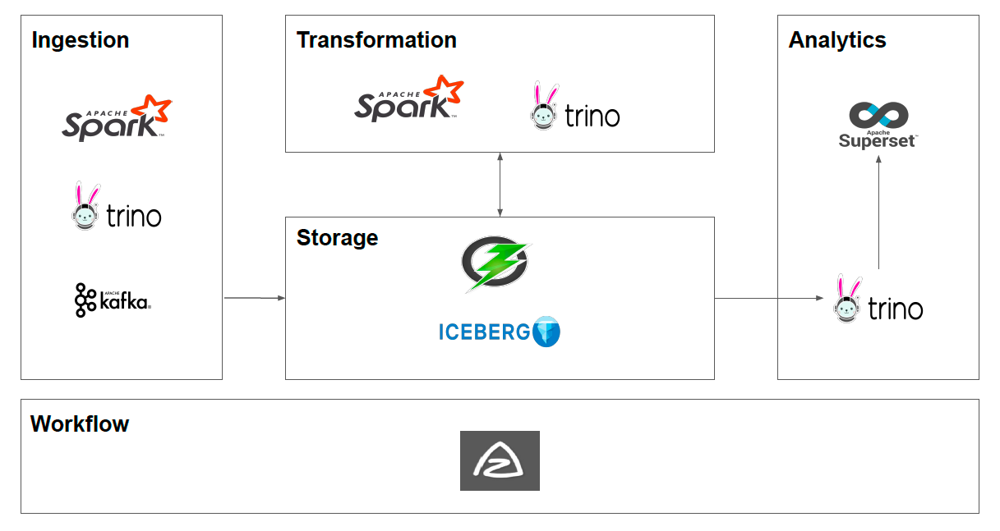

# Introduction

## What is Chango Private?

Chango Private is a Data Lakehouse Platform for offline / disconnected environment. 
All the data will be saved into iceberg tables on Ozone as s3 compatible object storage.

## Chango Private Data Lakehouse Platform

Chango Private provides most popular open source tools for data lake and data lakehouse with chango private specific tools.

- `Ingestion`: spark and trino are used to insert external data sources to iceberg in apache ozone object storage. Kafka is used for external streaming events which will be inserted into iceberg in ozone.
- `Storage`: apache ozone is used as s3 compatible object storage on which iceberg tables will be created.
- `Transformation`: spark and trino are used to execute etl jobs which will read iceberg tables and write data to iceberg tables on ozone.
- `Workflow`: azkaban orchestrates all data pipelines in ingestion and transformation layers.
- `Analytics`: superset is used as bi tool with connecting to trino directly or through chango private trino gateway. Trino is used to read all iceberg tables on ozone.

Chango Private also provides the following features.

- `Chango Private Storage Security`: RBAC to control fine-grained data access(catalog, schema and table level control) to chango storage. 
- `Chango Private Trino Gateway`: chango private trino gateway routes trino queries to upstream backend trino clusters dynamically.
- `Chango Private Streaming`: streaming events are saved to iceberg tables without streaming platform and streaming job.
- `Chango Private Data Ingestion`: external data like csv, json and excel are inserted into iceberg tables with ease.

 